# School_District_Analysis

# Overview 

The purpose of this project is to provide data analysis of the entire school district, which contains 15 schools. The data analysis of these school will assist in determining the schools funding based on the school grades. By conducting this analysis it’ll provide clarity on each schools’ performance in: math, reading, and their overall academic standings. It will filter through to show if the student themselves had passed math, reading, both, or neither. Eventually, new information comes to light in regards to a school suspected on academic dishonesty. 

The data was filtered through, cleaned, and corrected by utilizing a python environment with various modules imported to facilitate in the data correction. Both pandas and numpy were imported, which are essential to success of the analysis. Pandas allows for the creation of series, indexes, dataframes: while also providing the ability to edit the dataframes. Numpy, on the other hand, allows for scientific computing.

# Results 

The 9th grade students of the Thomas High School are being reanalyzed, as they are suspected of partaking in academic dishonesty.  The Thomas High School 9th graders have been removed from the data, since their academic dishonesty may skew the results, thus deeming the data faulty. Rather than removing the 9th graders of Thomas HS entirely or replacing the value with a 0 (zero), their data had been replaced with NaN. This was done so since replacing the value with 0’s would heavily impact the entire dataset, causing the averages to plumet. If we remove the 9th graders at THS data entirely, there would be substantial amount of data lost, but it would remove null values that would otherwise skewing the data. 

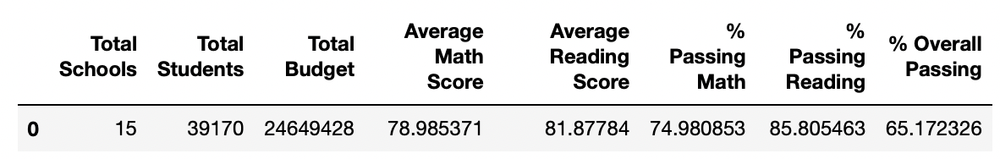
The district averages prior to entering the THS 9th graders values as NaN

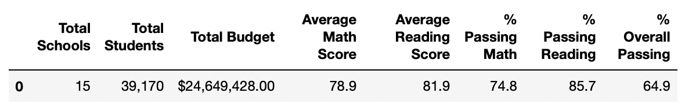
The district averages when the 9th graders of THS have NaN values

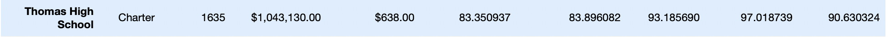
The removal of the 9th graders entirely 

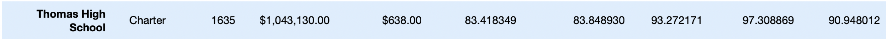
The 9th graders were untouched, prior to their investigation of potential academic dishonesty

After replacing the THS 9th graders data with NaN, the results were astonishing. The overall passing percentage for THS decreased from 91% to 67%. Since the overall average had a sharp drop, THS was no longer within the top 5 schools, due to all the NaN values for the 9th graders.

As for the overall passing percentage for the district, decreased by 0.3%. Since this includes the averages from THS, grades 10 to 12 (no NaN values), their passing percentage, alone was in the 90s across the board in the math, reading, and overall passing percentage.

Once the TSH 9th graders had their grades completely removed, there were minor changes to the to the overall outcome of the data. The overall passing percentages for THS had decreased from 90.95% to 90.63%, which is a 0.32% decrease. As for the percent passing math at THS, it increased by 0.08%, while the percent passing reading increased by 0.29%. The average math score decreased, by 0.06% and the average reading score decreased by 0.5%. The school ranking of 2nd, remained untarnished for TSH, even after the removal of an entire grade.

The top 5 schools in the district 

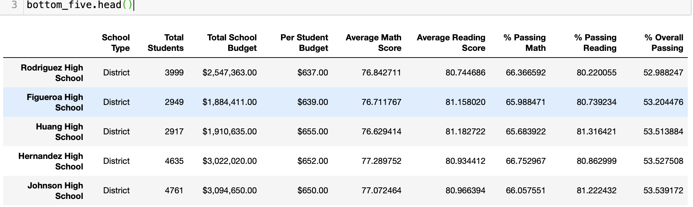
The lowest ranking (bottom 5) schools in the district

****Math and reading scores by grade*****

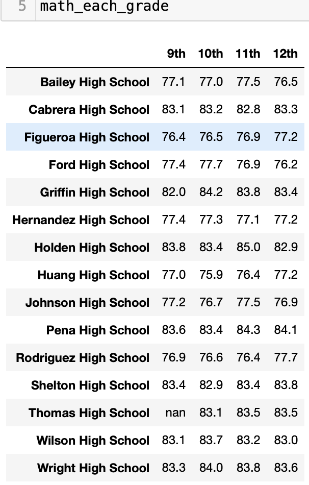
The average math average of each school seperated into grades

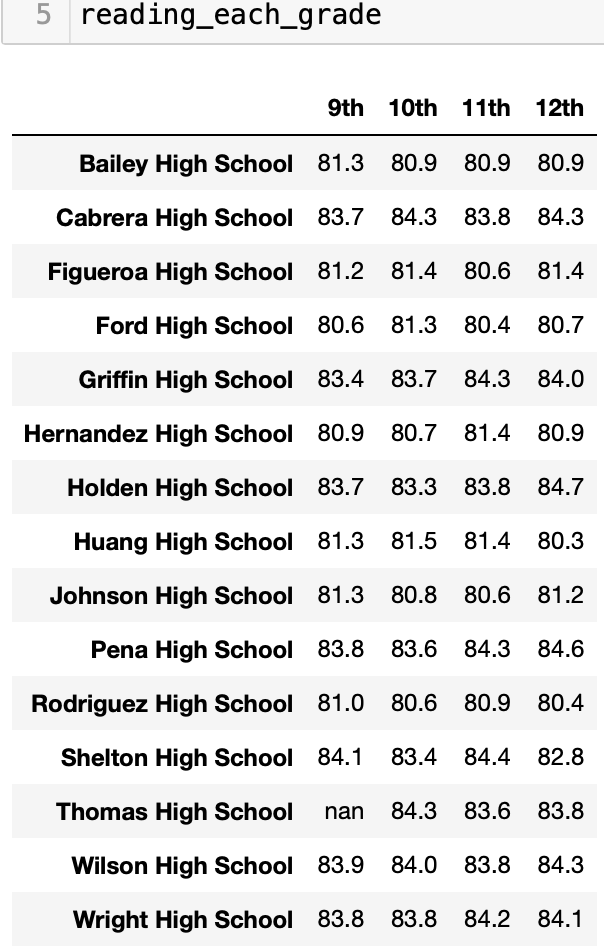
The average math average of each school seperated into grades

After looking at the average math and reading scores of every grade level within each school, the averages are consistent across the grades (9th thru 12th grade). The averages varied by less than 1%. When comparing each school within a particular grade, the difference is more apparent. The school with the highest 9th grade math average was Holden High School, while the lowest was Figueroa High School. The difference between the 2 schools 9th grade averages was less than 8%.

****Scores by school spending****

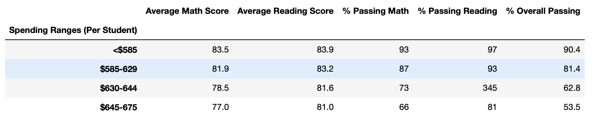
Spending ranges per student with their averages and percent passing 

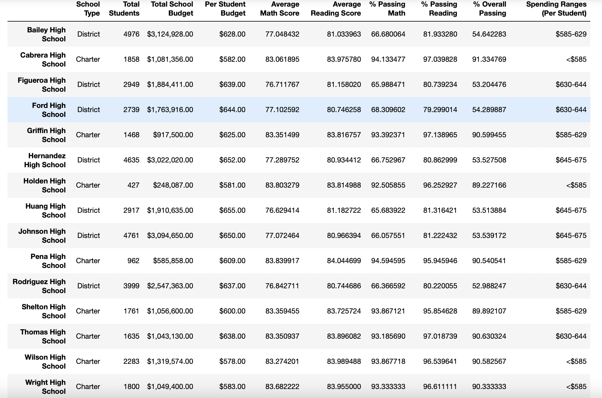
Shows every school with their spending ranges, budget, student total, etc. 

The average math and reading scores accompanied with the passing percentages don’t increase as cost per student increases. The school with the highest spending range per student had one of the lowest overall passing percentages. The school with one of the lowest spending ranges per student is the top school in the district. The top school in the district spendings $582 per student while the worst school spends $650 per student, which is a $68 difference per student. This may prove that having a higher budget may not be the most influential factor impacting the school’s performance and its’ students. 

****Scores by school size****

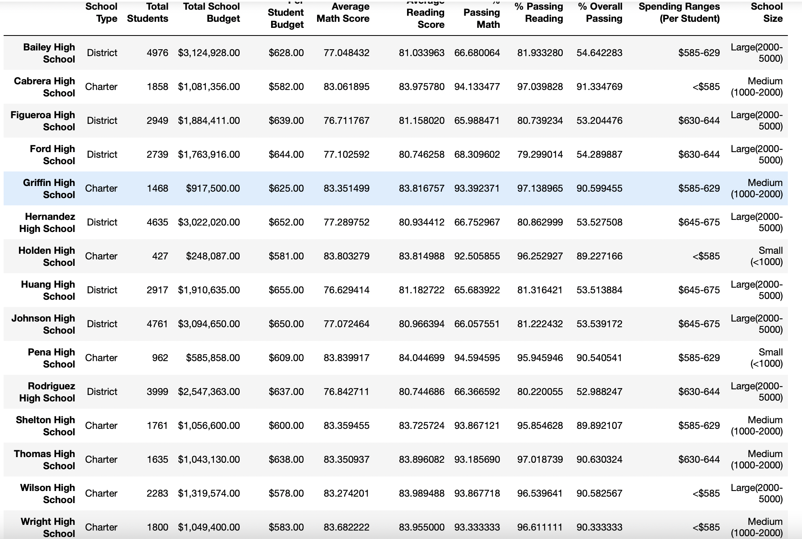
Shows every school with their size range, spending ranges, budget, student total, etc.

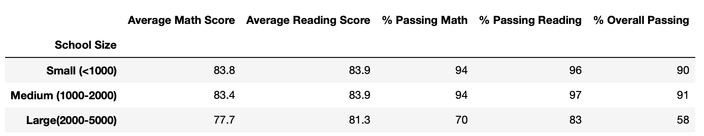
Shows the schools size range witht their averages and percent passing

The school size seems to impact the students’ performance, while we don’t know the environment of the students, such as: class room size, teacher to student ratio, etc. The larger schools (2,000 students or more) prove to have the lowest average scores and passing percentages. On the other hand, small or medium sized schools do significantly better than the larger schools. 8/15 schools have over 2,000 students and 7/8 of those schools are amongst the bottom schools in the district. The overall percent passing for those larger school that are in the 7 worst schools in the district, the 6th overall ranking school has an 89.22% overall passing percentage while the 7th overall ranking school had a 54.64% overall passing rate! The difference between schools would noticeably be their class size since the 7th ranked school has 4,761 students and the 6th ranked school had 427. The other factor is the 7th ranked school is a district school while the o6th ranked school is a charter school.

****Scores by school type****

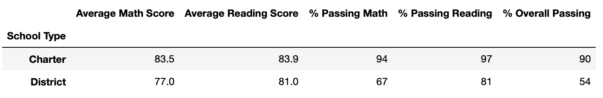

When looking the school types charter schools showed incredible academic performance as they have an astounding 90% overall passing, while district schools have a 54% overall passing percentage. Charter schools seem to have small or medium sized schools, while district schools have large schools.

# Summary 

After the math and reading score of the 9th graders of Thomas High School had been replaced by NaN, due to their, potential, academic dishonesty, we are still unable to determine if this speculation is true or false. It would be difficult to pinpoint if there were either couple of academically dishonest students or it was the entire 9th grade class. 

When the entire 9th grade had their scores replaced, the overall passing percentages and average scores (for math and reading) had fallen. Thomas High School lost its’ 2nd place rank as one of the best schools in the district. The 9th graders null values caused the school to take a heavy hit on their schools’ stats, but once the null value was removed the high school was back to being one of the top schools in the district. To remove the null values the entire 9th grade was removed, allowing THS to only take into account their 10th to 12th grades scores. Thomas High School, even with the removal of an entire grade, proves to be one of the best schools in the district. 
